# Beacon

Beacon is a vision guided TurtleBot3 simulation. A Waffle Pi in Gazebo Classic looks for a red cylinder with its camera, turns until the cylinder sits in the centre of the frame, drives towards it and stops in front of it. Ten scripted trials place the marker at different distances and bearings, two of them partly hidden behind a box, and a logger records every run for analysis.

You need Docker and a desktop session. Clone this repo, then run the blocks below from the repo root. Longer notes are in [docs/DOCKER_SETUP.md](docs/DOCKER_SETUP.md).

### 1. Build the image

About 15 to 30 minutes the first time.

```
docker build -f docker/Dockerfile -t beacon:humble docker
```

### 2. Start the container

About one minute.

```
docker/run.sh
```

The shell is now inside the container. The repo is at `/ws/src/turtlebot3-beacon`. On the host, `docker/exec.sh` opens a second shell in the same container.

### 3. Build the workspace

Inside the container. About one minute.

```
cd /ws
colcon build --symlink-install --packages-select beacon
source /opt/beacon_env.sh
```

### 4. Launch the simulation

About one minute until Gazebo and RViz are up.

```
cd /ws/src/turtlebot3-beacon
ros2 launch beacon sim.launch.py rviz:=true
```

### 5. Run all ten trials

In the second shell (`docker/exec.sh`). Up to about ten minutes.

```
cd /ws/src/turtlebot3-beacon
scripts/run_all_trials.sh
```

### 6. Make the figures and pick the debug frames

In that same second shell. Under one minute.

```
python3 scripts/analyze_trials.py
python3 scripts/pick_frames.py
```

Figures go to `docs/figures`. Debug frames go to `docs/screenshots`. The moments to photograph by hand are in [docs/screenshot_list.md](docs/screenshot_list.md). Camera checks and troubleshooting are in [docs/HOW_TO_RUN.md](docs/HOW_TO_RUN.md).

## Assignment mapping

| Part | What Beacon does | Where |
|---|---|---|
| Setup | Custom 6 m by 6 m room with two boxes, Waffle Pi spawned at the origin, one launch file | `worlds/beacon_room.world`, `launch/sim.launch.py` |
| Sensor | Camera frames from `/camera/image_raw`, LiDAR from `/scan`, odometry from `/odom` | `detector_node.py`, `controller_node.py`, `trial_logger_node.py` |
| Detection | HSV threshold with two red hue bands, morphology, largest contour, normalised horizontal offset | `beacon/vision.py`, tested by `test/test_vision.py` |
| Navigation | Five state controller: SEARCH, ALIGN, APPROACH, STOP, TIMEOUT, with a LiDAR safety stop | `controller_node.py` |

## Architecture

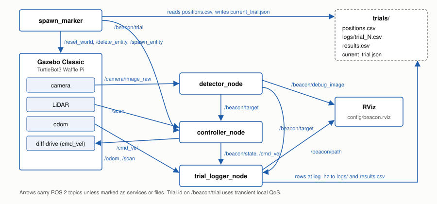

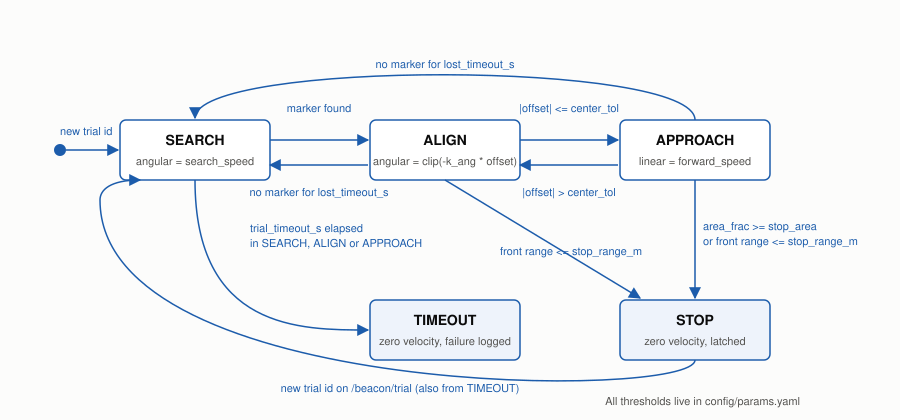

## States

| State | Condition | Command |
|---|---|---|
| SEARCH | no marker seen for `lost_timeout_s` | turn in place at `search_speed` |
| ALIGN | marker seen and abs(offset) > `center_tol` | angular = clip(-k_ang * offset, -max_ang, max_ang), no forward motion |
| APPROACH | marker seen and abs(offset) <= `center_tol` | linear = `forward_speed`, angular = -k_ang * approach_gain * offset |
| STOP | area_frac >= `stop_area` or front range <= `stop_range_m` | zero velocity, latched until the next trial id |
| TIMEOUT | `trial_timeout_s` passed without STOP | zero velocity, failure logged, latched |

Offset is (cx - W/2) / (W/2), so it runs from -1 at the left edge to +1 at the right edge. The front range is the smallest valid `/scan` range within `front_cone_deg` of straight ahead. Every node publishes zero velocity when it shuts down.

## Parameters

All of them live in `beacon/config/params.yaml`. The table below is the output of `scripts/params_table.py`. From the repo root, `python3 scripts/params_table.py` prints it again.

| Parameter | Default | Section |
|---|---|---|
| image_topic | /camera/image_raw | detector_node |
| qos_depth | 10 | detector_node |
| h_low1 | 0 | detector_node |
| h_high1 | 10 | detector_node |
| h_low2 | 170 | detector_node |
| h_high2 | 179 | detector_node |
| s_min | 120 | detector_node |
| v_min | 70 | detector_node |
| morph_kernel | 5 | detector_node |
| min_area_px | 150 | detector_node |
| center_tol | 0.1 | detector_node |
| log_period_s | 1 | detector_node |
| fps_window | 30 | detector_node |
| save_frames | true | detector_node |
| save_dir | docs/screenshots/frames | detector_node |
| save_period_s | 1 | detector_node |
| trials_dir | "" | detector_node |
| debug_top_px | 40 | detector_node |
| debug_bottom_px | 40 | detector_node |
| debug_margin_px | 12 | detector_node |
| debug_font_scale | 0.55 | detector_node |
| debug_font_thickness | 1 | detector_node |
| debug_line_px | 2 | detector_node |
| debug_dot_px | 5 | detector_node |
| debug_band_alpha | 0.35 | detector_node |
| debug_color_contour | [0, 255, 0] | detector_node |
| debug_color_centroid | [0, 255, 255] | detector_node |
| debug_color_bbox | [255, 200, 0] | detector_node |
| debug_color_centre_line | [255, 255, 255] | detector_node |
| debug_color_band | [120, 120, 120] | detector_node |
| debug_color_text | [255, 255, 255] | detector_node |
| debug_color_strip | [30, 30, 30] | detector_node |
| debug_color_bar | [200, 200, 200] | detector_node |
| debug_color_bar_marker | [0, 0, 255] | detector_node |
| control_hz | 10 | controller_node |
| qos_depth | 10 | controller_node |
| lost_timeout_s | 1 | controller_node |
| search_speed | 0.3 | controller_node |
| center_tol | 0.1 | controller_node |
| k_ang | 1 | controller_node |
| max_ang | 0.8 | controller_node |
| forward_speed | 0.15 | controller_node |
| approach_gain | 0.5 | controller_node |
| stop_area | 0.12 | controller_node |
| stop_range_m | 0.35 | controller_node |
| trial_timeout_s | 60 | controller_node |
| front_cone_deg | 15 | controller_node |
| log_hz | 10 | trial_logger_node |
| qos_depth | 10 | trial_logger_node |
| trials_dir | "" | trial_logger_node |
| path_max_poses | 6000 | trial_logger_node |
| json_retry_s | 0.5 | trial_logger_node |
| json_retries | 10 | trial_logger_node |
| front_cone_deg | 15 | trial_logger_node |
| room_size_m | 6 | beacon_shared |
| wall_thickness_m | 0.2 | beacon_shared |
| wall_height_m | 0.5 | beacon_shared |
| box_size_m | 0.4 | beacon_shared |
| box1_x | 1 | beacon_shared |
| box1_y | 0.8 | beacon_shared |
| box2_x | -1.2 | beacon_shared |
| box2_y | -0.9 | beacon_shared |
| marker_radius_m | 0.075 | beacon_shared |
| marker_height_m | 0.3 | beacon_shared |
| camera_hfov_deg | 62.2 | beacon_shared |
| n_trials | 10 | beacon_shared |
| occluded_trials | 2 | beacon_shared |
| dist_min_m | 1 | beacon_shared |
| dist_max_m | 2.5 | beacon_shared |
| clearance_m | 0.4 | beacon_shared |
| occlusion_extra_dist_min_m | 0.8 | beacon_shared |
| occlusion_extra_dist_max_m | 1.1 | beacon_shared |
| default_seed | 42 | beacon_shared |
| spawn_settle_s | 1 | beacon_shared |
| service_timeout_s | 10 | beacon_shared |
| marker_entity_name | red_marker | beacon_shared |

## Topics

| Topic | Type | Direction |
|---|---|---|
| /camera/image_raw | sensor_msgs/Image | Gazebo to detector |
| /scan | sensor_msgs/LaserScan | Gazebo to controller and logger |
| /odom | nav_msgs/Odometry | Gazebo to logger |
| /cmd_vel | geometry_msgs/Twist | controller to Gazebo |
| /beacon/target | geometry_msgs/Point | detector to controller and logger. x offset, y area fraction, z 1.0 when found |
| /beacon/debug_image | sensor_msgs/Image | detector to RViz or rqt_image_view |
| /beacon/state | std_msgs/String | controller to everyone |
| /beacon/trial | std_msgs/String, transient local | spawn_marker to controller and logger |
| /beacon/path | nav_msgs/Path | logger to RViz |
| /reset_world, /delete_entity, /spawn_entity | services | spawn_marker to Gazebo |

## Results

One run of `scripts/run_all_trials.sh` in the container. Five trials reached the marker. The figure script keeps the last row of a trial, so the two early trial 3 rows in `results.csv` are not in this table.

| Trial | Reached | Time s | Final range m | Path m |
|---|---|---|---|---|
| 1 | 1 | 8.00 | 0.679 | 1.077 |
| 2 | 0 |  | 3.112 | 0.034 |
| 3 | 1 | 13.20 | 0.686 | 1.202 |
| 4 | 0 |  | 3.104 | 0.034 |
| 5 | 1 | 13.30 | 0.699 | 0.455 |
| 6 | 0 |  | 3.155 | 0.034 |
| 7 | 1 | 26.90 | 0.667 | 1.418 |
| 8 | 1 | 13.00 | 0.695 | 1.771 |
| 9 | 0 |  | 3.101 | 0.034 |
| 10 | 0 |  | 3.101 | 0.034 |

Success rate 50%. Mean time to reach 14.9 s, max 26.9 s. Mean final range on a reach 0.69 m.

## Trials

`beacon/trials/positions.csv` holds ten marker positions drawn with seed 42: distances from 1.0 to 2.5 m, bearings spread around the full circle so eight trials start with the marker out of view, and two trials (9 and 10) with the marker half hidden behind a box. `scripts/run_trial.sh N` runs one trial and prints its `results.csv` row. The protocol, the success rule and the column definitions are in [docs/trial_protocol.md](docs/trial_protocol.md).

## Figures

`python3 scripts/analyze_trials.py` reads `results.csv` and the per trial logs and writes these images to `docs/figures`. It also prints the success rate, the mean and max time to reach, and the mean final range.

### Paths

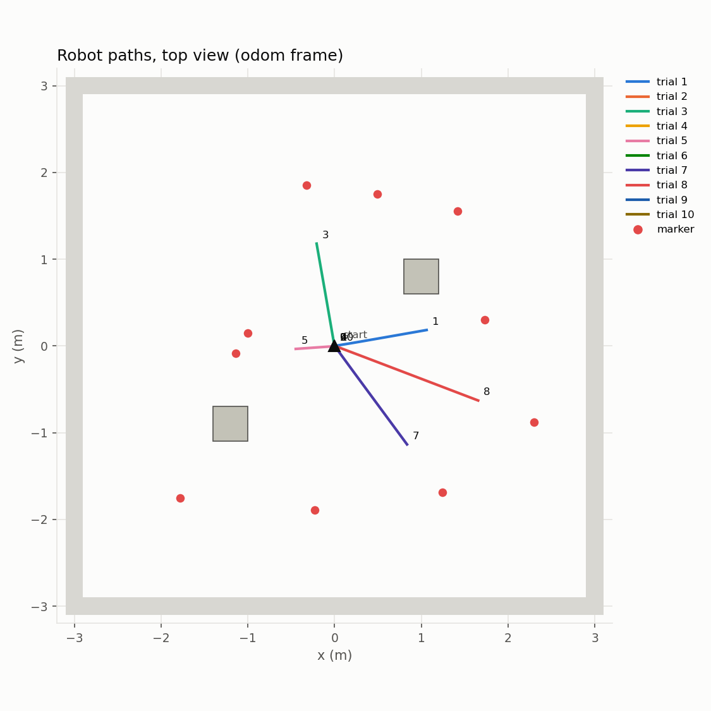

The room, the two boxes, every marker, and the path of each trial.

### Time to reach

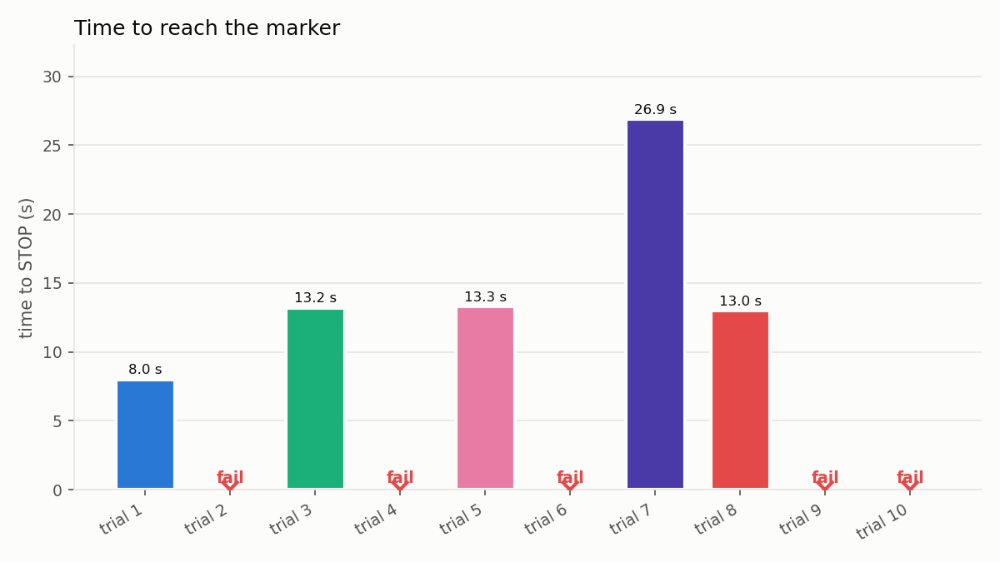

Time to STOP for each trial. A miss is marked as a failure.

### State timeline

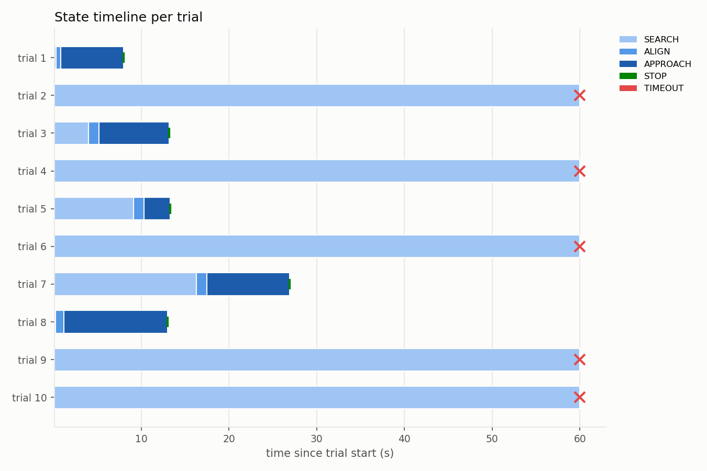

SEARCH, ALIGN, APPROACH, and STOP for each trial.

### Offset

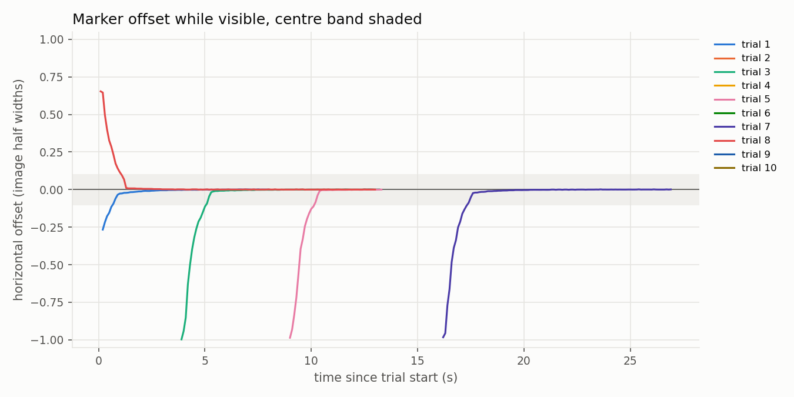

Horizontal offset of each trial. The shaded band is the centre tolerance.

### Results image

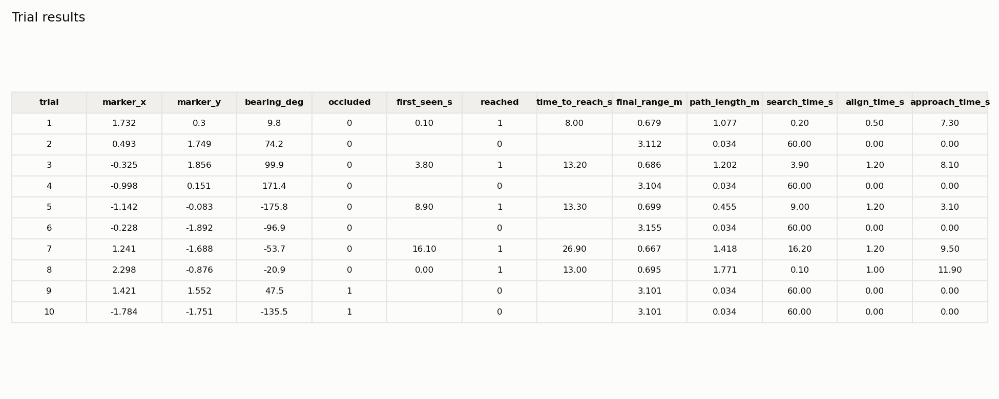

The same results table drawn as a figure.

## Screenshots

Taken on the host during the container run. The four debug images are trial 1 frames chosen by `scripts/pick_frames.py`.

### Gazebo

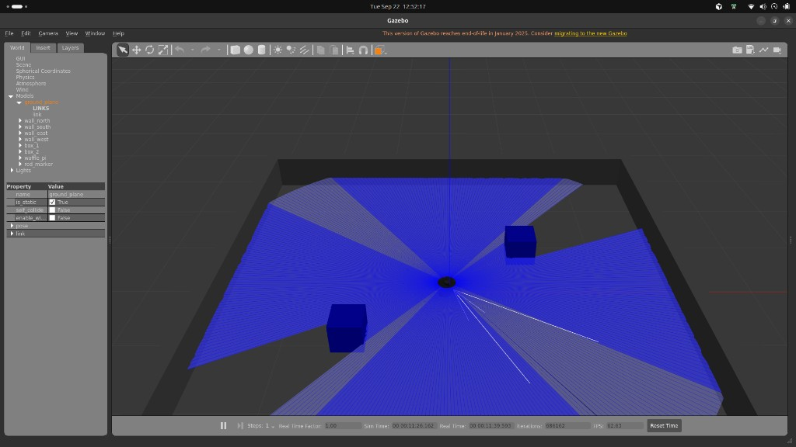

The room, both boxes, and the robot. The red marker is in the model list. The lidar fan covers the centre of the view.

### RViz

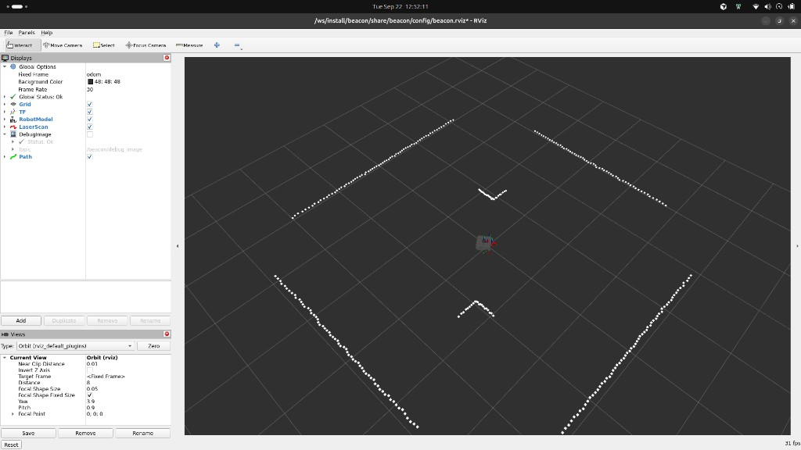

Laser scan of the walls, the robot model, and the path display, with global status ok.

### Debug image in each state

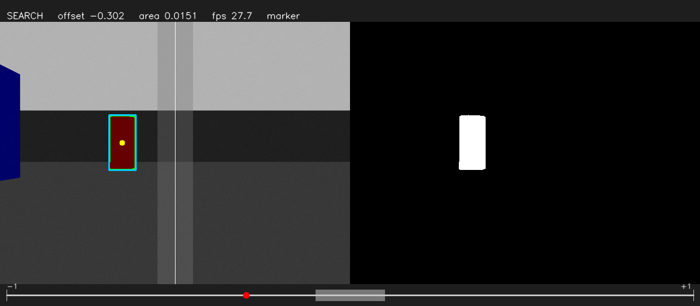

SEARCH.

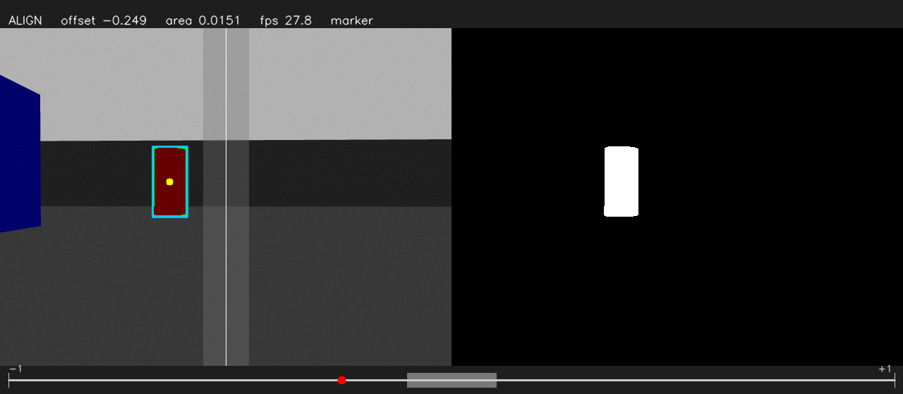

ALIGN.

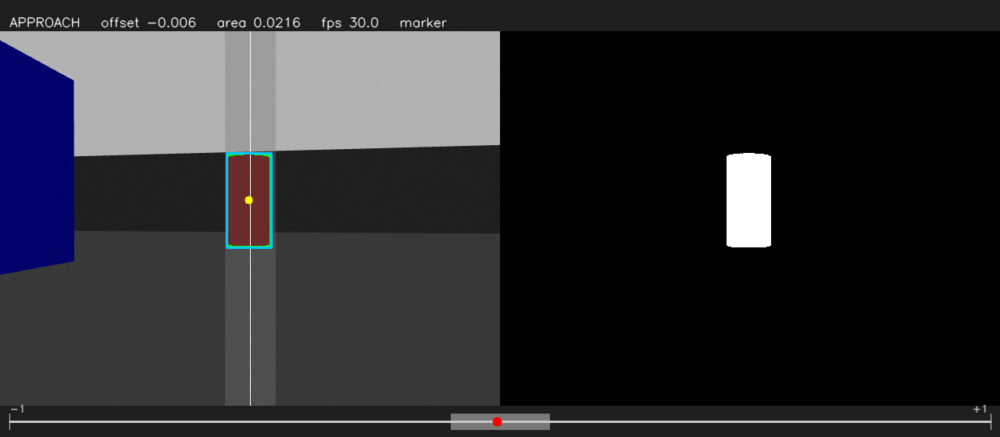

APPROACH.

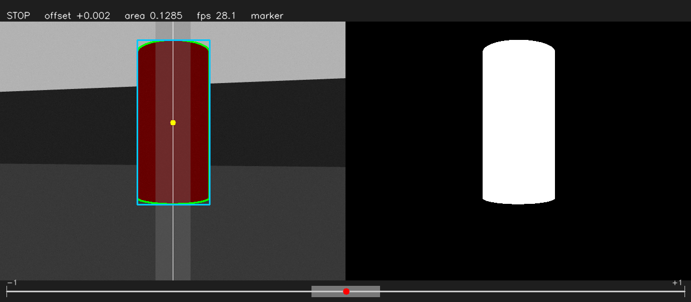

STOP.

### Topic list

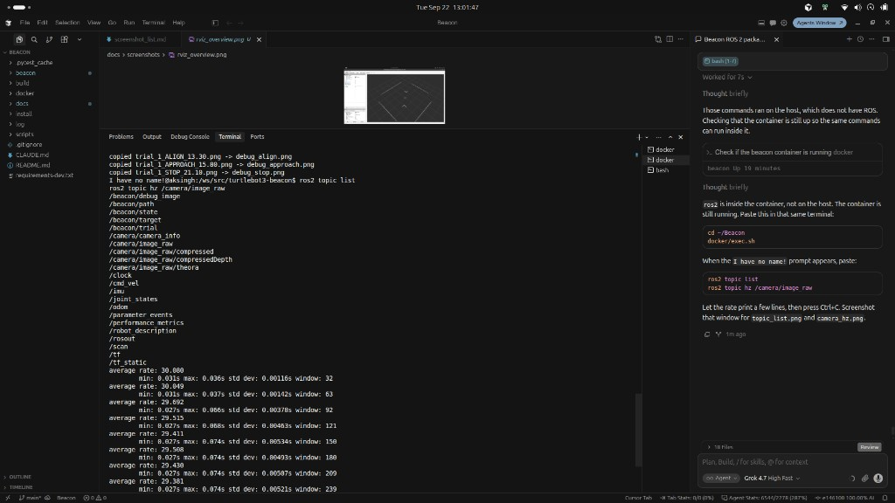

Topics while the simulation was running, including `/camera/image_raw`, `/scan`, `/odom`, and the `/beacon` topics.

### Camera rate

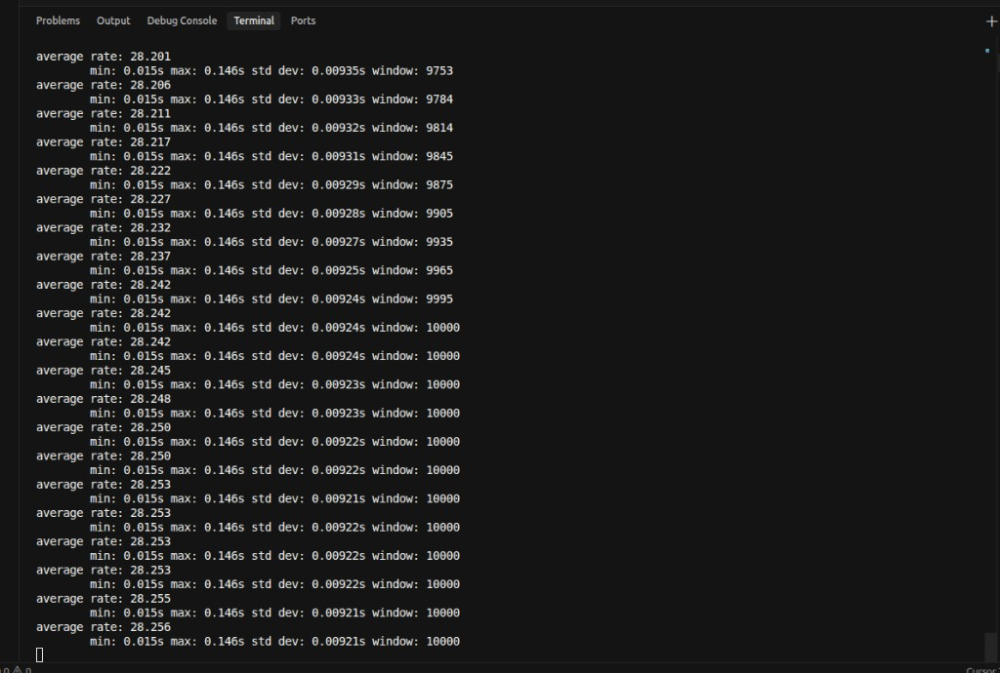

`/camera/image_raw` published at about 28 frames a second.

### Results printout

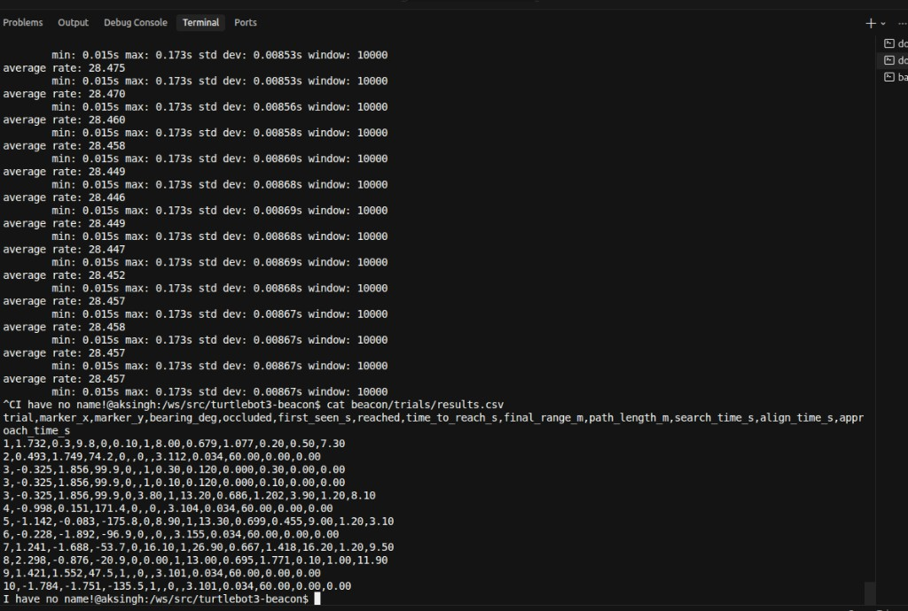

`beacon/trials/results.csv` printed in the container after the ten trials.

## Tests

```
pip install -r requirements-dev.txt
cd beacon && python3 -m pytest test -v
```

The vision tests use synthetic images and need no ROS.

## Layout

```
beacon/            ROS 2 package (ament_python): nodes, launch, world, model, config, trials, tests
docker/            Humble image, start script, second shell script
scripts/           run_all_trials.sh, run_trial.sh, analyze_trials.py, pick_frames.py
docs/              DOCKER_SETUP.md, HOW_TO_RUN.md, trial_protocol.md, diagrams, figures, screenshots
```
